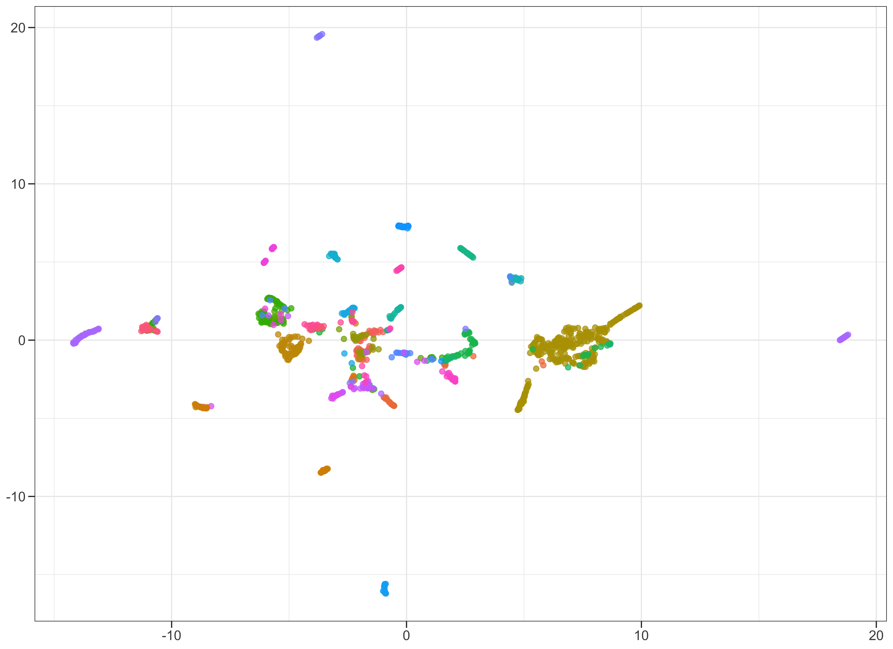
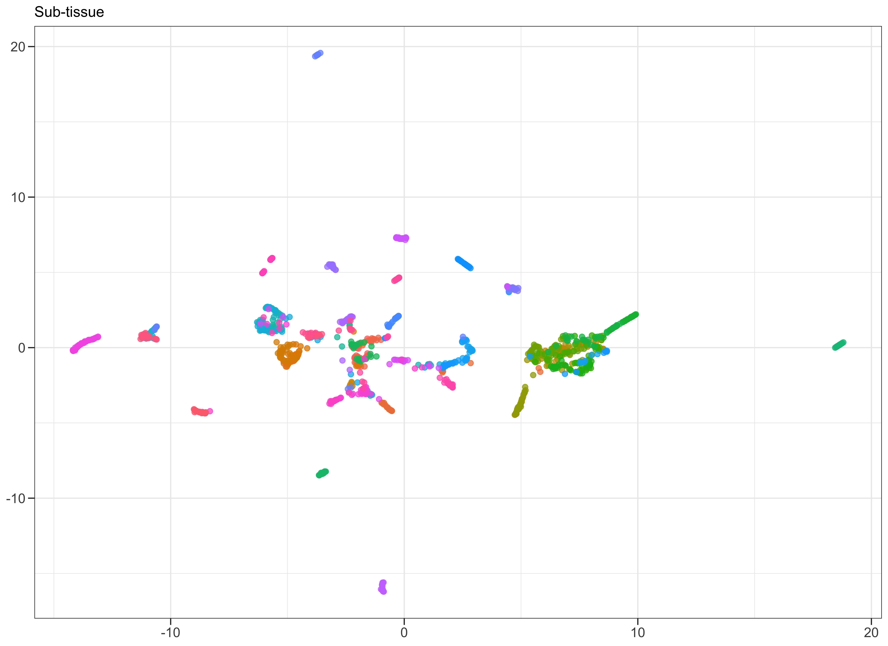

# Parsing the GTEx data

Here I'm exploring the GTEx RNA-seq data which is readily available at the [GTEx portal](https://gtexportal.org/home/). This small R project will generate an `R` data frame for easy exploration (currently working on making it a tidy data set). Below I have a couple of UMAP plots on the samples, for exploratory/exemplary analyses.

## Number of different tissues
One of the aspects of interest is to check how many sub-tissues were sampled and made available. From the data set:

```r
samples <- samples %>% 
  dplyr::mutate(., tissue = sample_annotations$SMTSD[match(X1, sample_annotations$SAMPID)]) %>%
  dplyr::mutate(., type = sample_annotations$SMAFRZE[match(X1, sample_annotations$SAMPID)]) %>%
  dplyr::mutate(., broader_type = sample_annotations$SMTS[match(X1, sample_annotations$SAMPID)])

samples %>%
  dplyr::group_by(., tissue) %>%
  dplyr::count() %>%
  ggplot() + 
  geom_col(aes(y = n, x = forcats::fct_reorder(tissue, n))) +
  coord_flip() + 
  theme_bw() + 
  theme(axis.text = element_text(color = "black", size = 12),
        axis.title = element_blank(),
        axis.ticks.length = unit(0.2, "cm"))
```

which will produce:


## UMAP on tissues
Running UMAP on a subset of samples and subset of genes. In R:

```r
umap_plot <- umap::umap(d = t(data_mat), 
                        method = "naive", 
                        random_state = 123,
                        n_epochs = 100,
                        min_dist = 0.1,
                        n_neighbors = 15, 
                        metric = "cosine")
```

which produces:



## UMAP on sub-tissue classification
Same as before. Plot:


